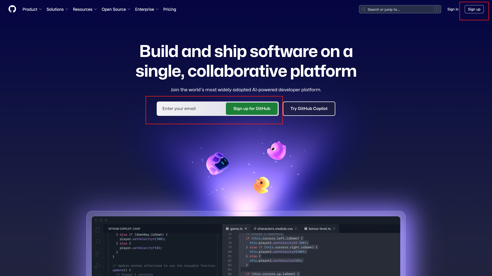
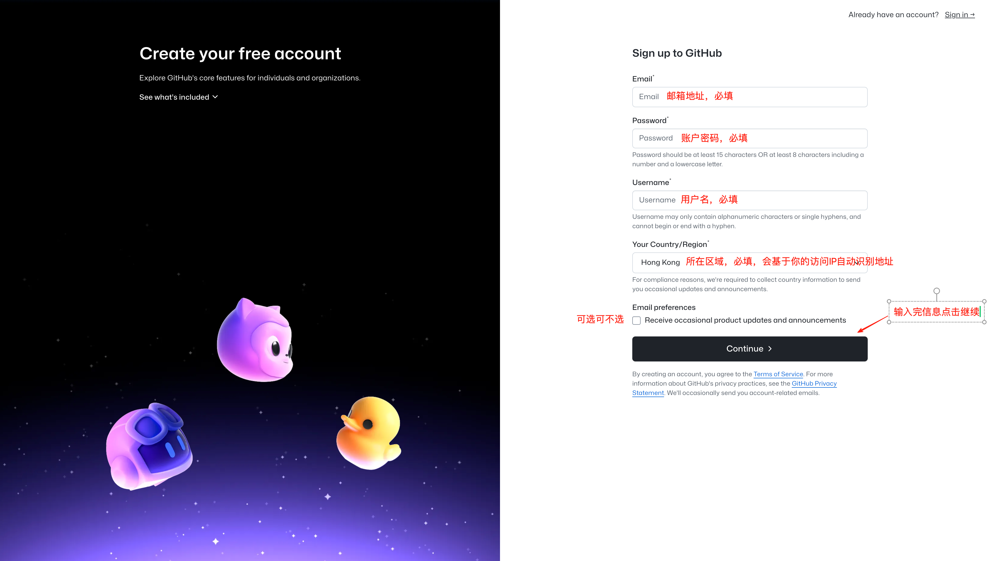
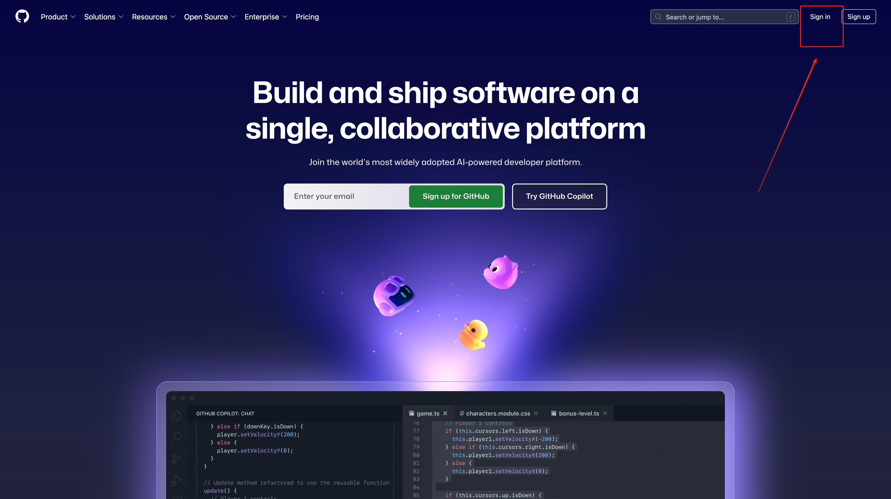
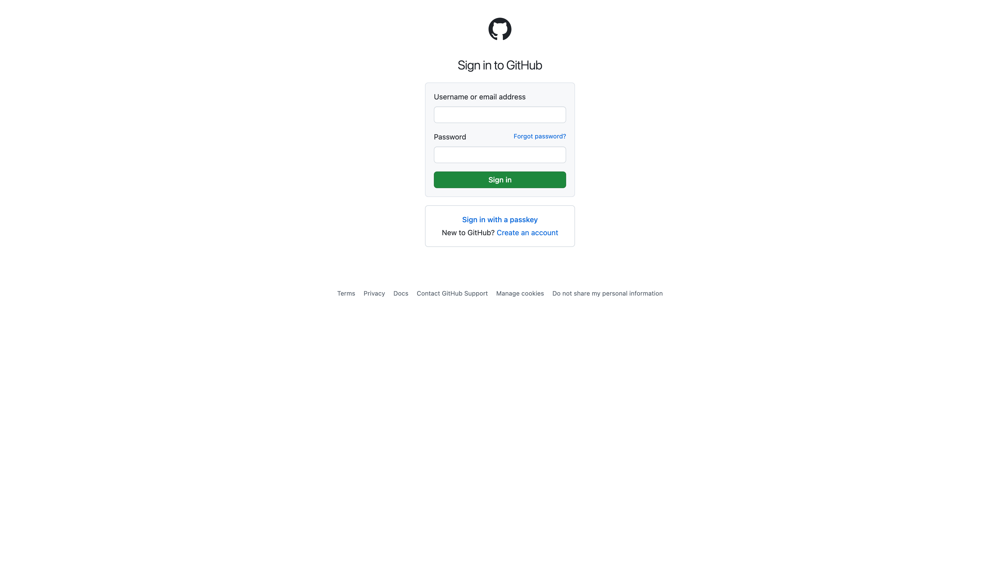

# 大陆用户如何注册Github账号

## 进入Github官网

- 进入[Github官网](https://github.com/)
- 如果你无法访问Github官网，参考[📋 大陆链接Github教程](./大陆链接Github教程.md)

## 点击官网注册按钮

- Sign up 为注册按钮

- 输入信息进行注册流程

- 注册期间，系统会要求验证电子邮件地址。 如果不验证电子邮件地址，将无法完成某些基本的 GitHub 任务，例如创建存储库。

- 注册过程中可能会出现邮箱验证失败的问题，比如出现失败信息
    - Unable to verify your captcha response. please visit https://docs.github.com/articles/troubleshooting-connectivityproblems/#troubleshooting-the-captcha for troubleshooting
    - 解决办法
        - 在注册失败的页面点击浏览器返回按钮，点击一次即可

        

        - 使用新浏览器标签页打开[captcha替换网址](https://octocaptcha.com/)
        - 进入网页进行验证，按照步骤进行验证操作,这一步可能会有延迟需要耐心
        
        - 回到注册输入邮箱和密码的页面。将用户名，邮箱，密码填完后下面还会出现以上验证，按照步骤完成即可，然后创建账户。
        - 创建成功后，在邮箱中会收到验证码，在注册的页面填写验证码，完成注册流程
    

- 邮箱验证通过后即完成注册流程

## 进行登录

- 访问Github官网点击Sign In 进入登录

- 输入登录信息执行登录

